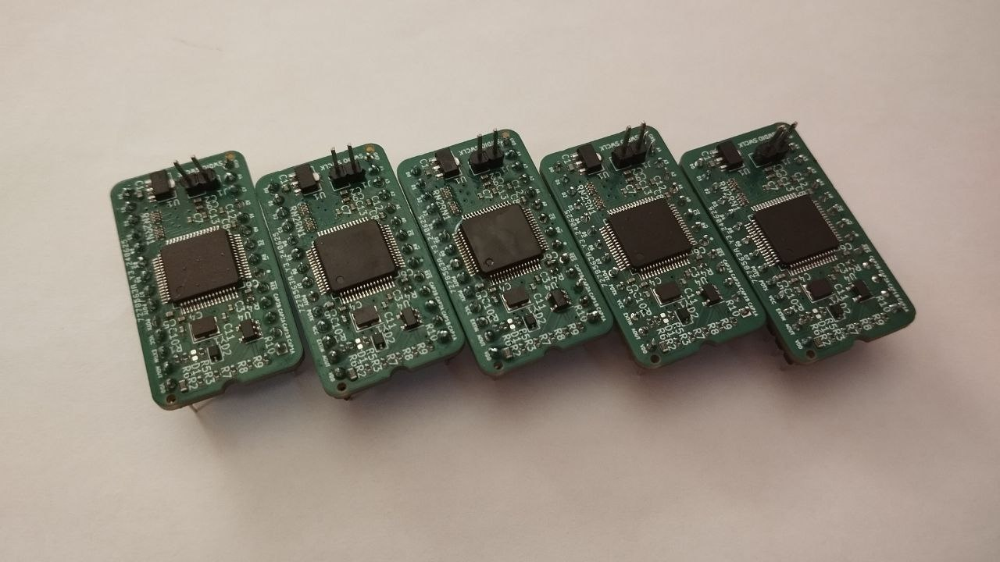
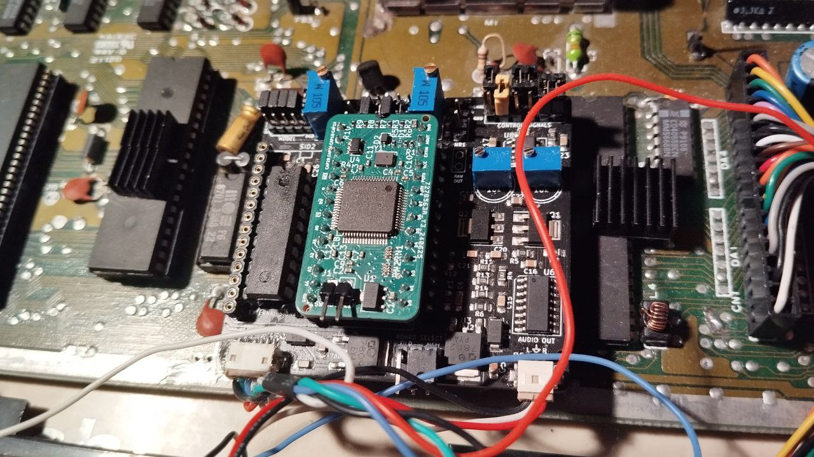
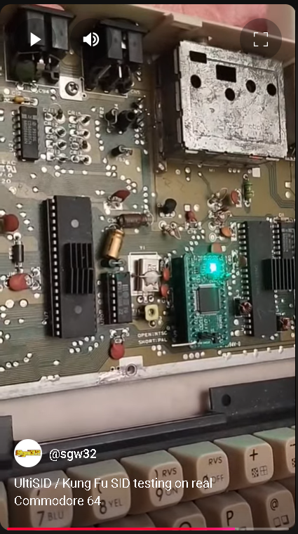
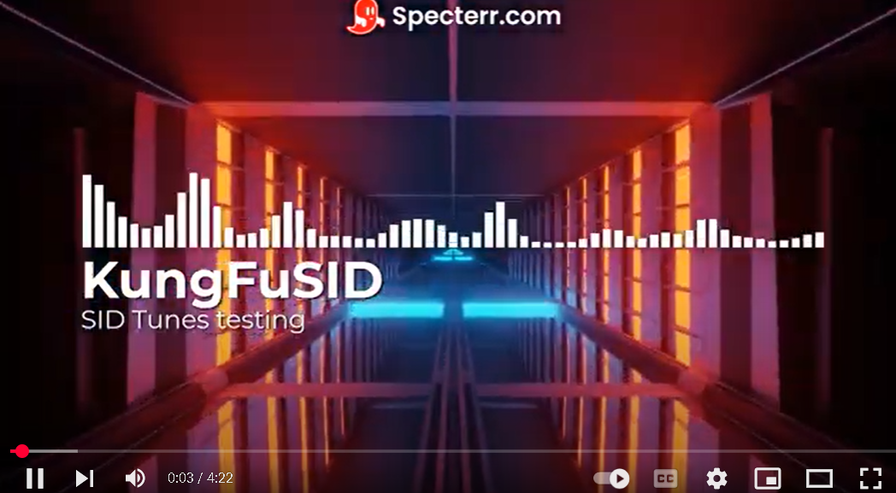

# Kung Fu SID GD32 version

IMPORTANT! Firmware is adjusted for new Kung Fu SID hardware (and only)

## Introduction

Project is heavily inspired by __SwinSID__ and __ArmSID__ project. And is maintained as an open-source alternative to them.
Now it is even working on a GD32F405RGT6 on 168 MHz with 8 MHz crystal, just like Kung Fu Flash - and firmware is using critical code from KFF. 
I'm looking for contributers(I can even pay for the work) who will add some assembler optimization magic into SID code. 

A firmware for Kung Fu Flash and Kung Fu Flash GD32 which emulates SID via internal DAC of STM32F405RGT6
All hardware files are copied from "UltiSID" , projects are merged. 
Original UltiSID firmware is obsolete and current Kung Fu SID firmware just is partly based on it in IRQ and SID emulation. 

You can test Kung Fu SID by compiling firmware and flashing to your kung fu flash. 

To use it with original KungFuFlash cartridge output - check previous commits. 
Now only KungFuSID hardware is supported(and devices are selling)

Example usage with MixSIDs (you can use it directly, of course)

Patched by avrem for GD32F405RGT6 microcontroller.
Patch includes:
* ARR timer fix for GD32
* Memory remap fix (since KFF is running from RAM)

You can use both GD32 or STM32. 

## Future plans

I need to finish paddles, 6581-8580 switch and make a bootloader(optional, though). Probably, that's it and project will be finished. 
Some tunes still require some improvements, e.g. Artillery Credits by Geir Tjelta

## Limitations

* No 6581/8580 switch
* No paddles(can be done though)

## Video(and audio) 

## New video:

**PLEASE LIKE AND SUBSCRIBE😊**

Old video featuring old UltiSID firmware:

## Credits and special thanks:

* Tolaemon's NanoSwinSID page with open-hardware PCB available: http://www.tolaemon.com/nss/ 
My PCB is a modified version of SwinSID PCB

* ArmSID page with schematic: https://www.nobomi.cz/8bit/armsid/index_en.php
* Teensy SID emulator (huuuge, not really good): https://www.pjrc.com/c64-sid-chip-replacement/ and https://github.com/kokotisp/6581-SID-teensy
* SID BluePill emulators:
https://github.com/Bakisha/STM32-SID-PLAYER - my code is 80% based on this repository
https://github.com/dkm1978/BluePillSid - references
* Swinkels page - dead http://www.swinkels.tvtom.pl/swinsid/
Available on Archive.org - please check it, there is a SID emulation source for SwinSID atmega8515.
* Kung Fu Flash - https://github.com/KimJorgensen/KungFuFlash
I am inspired by simplicity of it and its power. 
* Pavel Myasnikov
Author of KungFuSID hardware design 
* Special greetings to Protovision Games

## Support us

Buy UltiSID here:
https://www.amibay.com/threads/kungfusid-sid-chip-emulator.2449119/

Crypto: 
0xeDc17cb23241eACe19DF3617291aa7d2d92E62DC (ETH, USDT ERC20)
Buy something here (3d models):
https://www.cgtrader.com/sgw32

