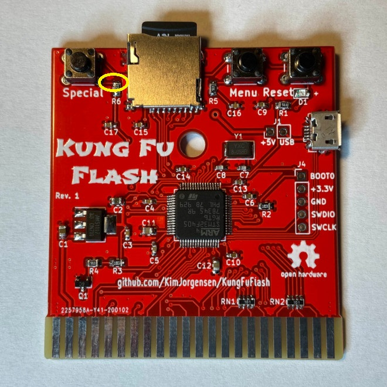

# Kung Fu SID GD32 version

IMPORTANT! Firmware is adjusted for new Kung Fu SID hardware 

A firmware for Kung Fu Flash and Kung Fu Flash GD32 which emulates SID via internal DAC of STM32F405RGT6
Kung Fu SID is a future firmware for "UltiSID":

https://github.com/Sgw32/UltiSID

Original UltiSID firmware is obsolete and current Kung Fu SID firmware just is partly based on it in IRQ and SID emulation. 

You can test Kung Fu SID by compiling firmware and flashing to your kung fu flash. 

Here you can have the sound:

Just attach it using wire to pin 27 of SID(6581/8580). A sound is a bit silent but in final hardware it will work. 

Patched by avrem for GD32F405RGT6 microcontroller.
Patch includes:
* ARR timer fix for GD32
* Memory remap fix (since KFF is running from RAM)

GD32 is more available than official STM32 making it better and cheaper for use. 